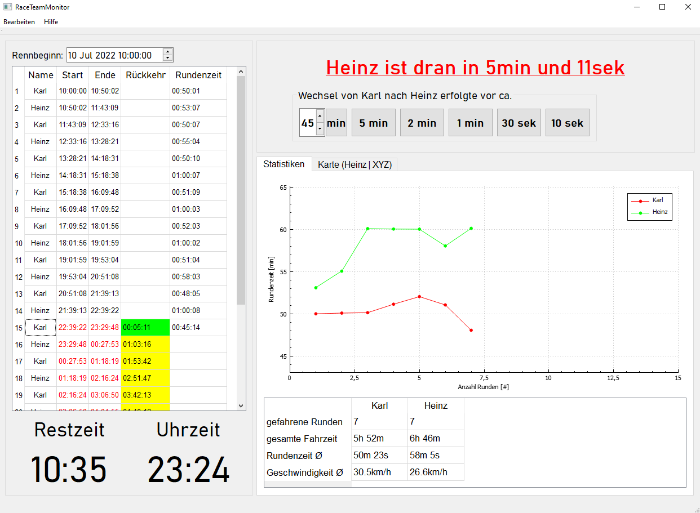
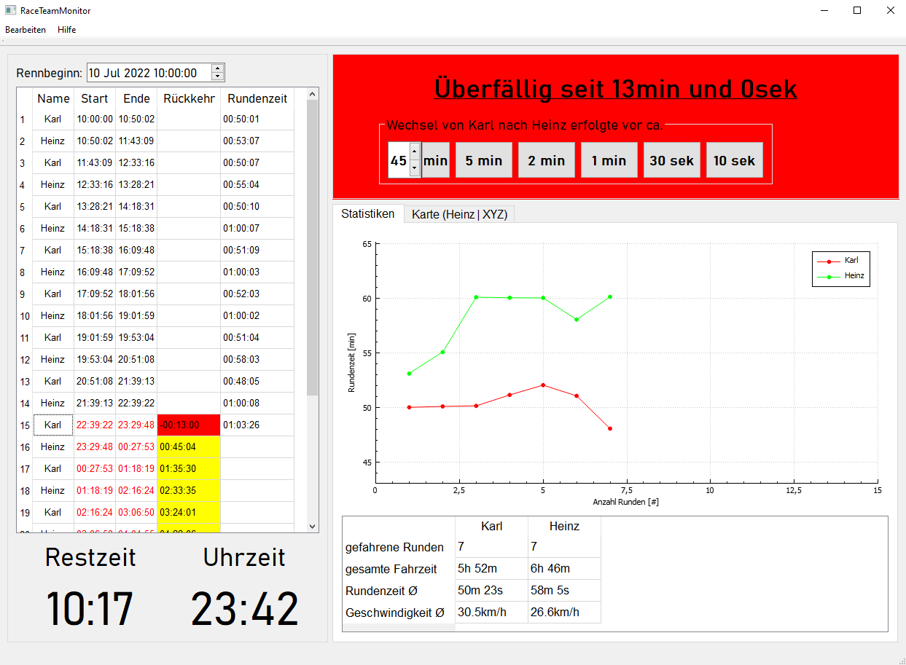
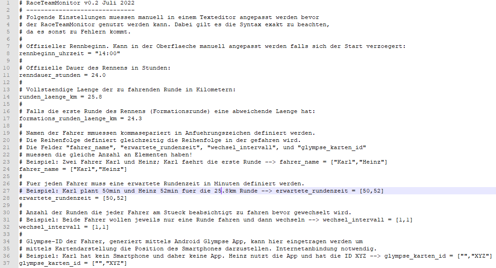

# RaceTeamMonitor

Der RaceTeamMonitor dient der Überwachung von Rundenzeiten mehrerer Fahrer bei einem mehrstündigen Radrennen.
Das händische Notieren von Rundenzeiten und Berechnen von Ankunftszeiten hat hiermit ein Ende. Unklarheiten mitten in der Nacht, mit dicken Beinen und leerem Kopf,
wer wann wieso als nächster an der Reihe ist gehören der Vergangenheit an. Es wird lediglich ein Windows-Laptop oder Tablet benötigt.
Nach der initial notwendigen Konfiguration des Events (Streckenlänge, Anzahl & Namen der Fahrer, erwartete Rundenzeiten, etc.) ist es nur noch nötig den Zeitpunkt des Wechsels
per Mausklick zu definieren. Der Rest, wie z.B. die Neuberechnung der zukünftigen Wechselzeitpunkte sowie die Anpassung der Statistik erfolgt automatisch.

## Features

- Überwachung der Wechselzeiten
- Änderung des Rennstarts bei Verzögerung
- Generierung von Statistiken inkl. Visualisierung
- Einfügen von Pausen falls kein Fahrer fährt
- Änderung der ursprünglichen Wechselreihenfolge z.B. bei Ausfall oder Defekt
- Einbettung von [https://glympse.com/](https://glympse.com/) ermöglicht die Darstellung der aktuellen Position der Fahrer
- Kein Datenverlust bei Absturz

Beispiel: Karl wird voraussichtlich in 5min (um 23:29Uhr) einteffen. Heinz sollte also schon die Schuhe an haben und bereit stehen falls Karl doch etwas schneller ist.

Heinz steht schon die ganze Zeit parat aber Karl lässt seit 13min auf sich warten. Vielleicht hatte er einen Einbruch oder eine Panne? Ah da ist Karl zu sehen, er kommt!
Es wird schnell gewechselt. Jetzt muss Karl nur noch daran denken den Knopf "30sek" zu drücken, weil Heinz vor ca. 30sek los gefahren ist.
Der Wechselzeitpunkt wird entsprechend berechnet.

## Konfiguration
Da das Tool mit der heißen Nadel gestrickt ist und rechtzeitig zu Rad am Ring 2022 genutzt werden soll bietet die Version v0.2 noch nicht die Möglichkeit
mittels Oberfläche konfiguriert zu werden. Stattdessen ist es notwendig vor dem ersten Start des Tools die Datei "konfiguration.toml" in einem Texteditor zu bearbeiten.
Die Datei selbst enthält dazu alle notwendigen Informationen und Beispiele. Die Hinweise müssen lediglich gewissenhaft gelesen und befolgt werden (RTFM).
Dann steht einer erfolgreichen Konfiguration nichts im Wege. Die aktuell gewählte Streckenlänge bezieht sich auf Rad am Ring.

## Glympse [https://glympse.com/](https://glympse.com/) 
Für jeden Fahrer kann in der Konfigurationsdatei eine Glympse-ID definiert werden. Jene ID erhält man wenn man die Glympse-App auf seinem Smartphone installiert und
die eigene Position teilt. Über die ID kann mittels WebBrowser, der in den RaceTeamMonitor integriert ist, die aktuelle Position des Smartphones und damit des aktuellen
Fahrer nachverfolgt werden. Dies dient lediglich der Visualisierung und wird nicht in sonstige Berechnungen einbezogen. Der Laptop auf dem der RaceTeamMonitor betrieben wird
benötigt dafür eine Internetanbindung, z.B. über einen mobilen Hotspot.

## Datenbasis
Im Ordner "data" werden alle Rundendaten gespeichert, aufsteigend und beginnend mit der Datei "0000.laps". Die Datei mit dem höchsten Index dient als aktuelle
Datengrundlage für die Berechnungen. Pro Änderung (z.B. Wechsel durchgeführt oder Pause eingefügt) wird eine neue Datei angelegt.
